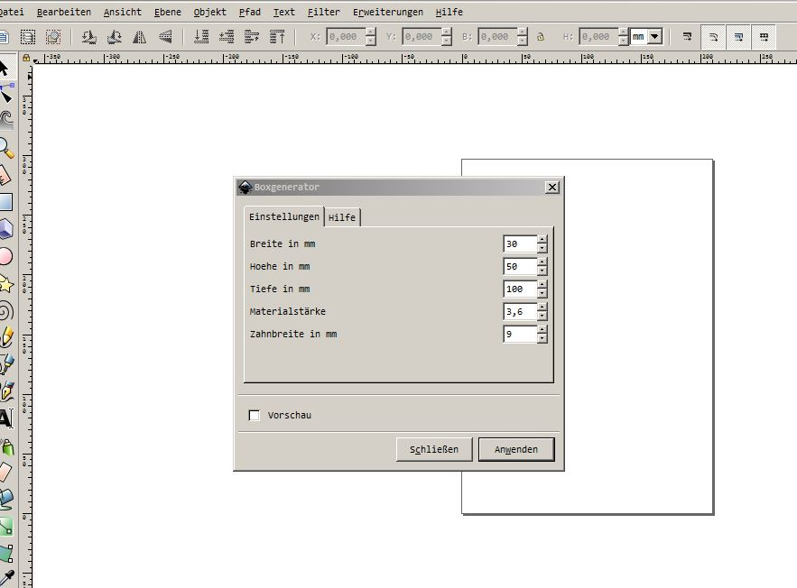
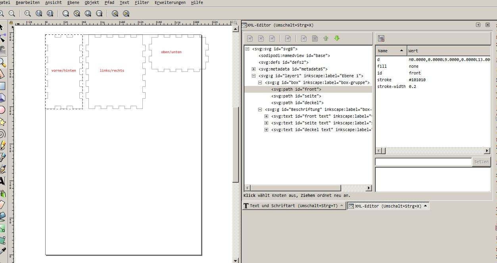

# Inkscape-Box-Generator

Eine **Erweiterung für Inkscape**, geschrieben in **Python** um eine Box mit Fingerzinken für einen **Lasercutter** zu generieren. 

Das Programm gibt es auch als reine Pythonausführung hier:

 [https://github.com/minirevollo/Box-Generator](https://github.com/minirevollo/Box-Generator)

Im Programm werden die **Dimensionen** der Box, die **Materialstärke** und die **Zinkenbreite** eingegeben.

----------

Es werden nur drei Seiten der Box angezeigt. Für die komplette Box müssen diese Seiten **zweimal** geschnitten werden. 

Auf den Flächen können nun auch noch Gravierungen oder Löcher eingearbeitet werden.

Im **XML Editor von Inkscape** kann man schön den Aufbau der SVG erkennen.

----------

----------

Die beiden Dateien **boxengenerator.py** und **boxengenerator.inx** in den Ordner **...Programme/inkscape/share/extensions** kopieren und **Inkscape neu starten**.

